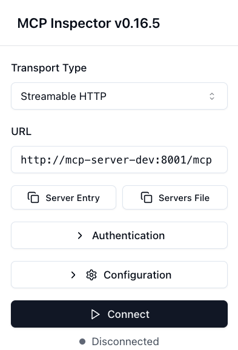
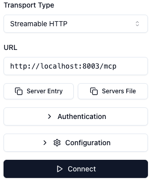

# Lab 1: Set up MCP for Splunk (🔧)

Install prerequisites, prepare your environment, and run the MCP server.

## 1. Install prerequisites

This guide provides comprehensive installation instructions for all prerequisites needed to run the MCP for Splunk on Windows, macOS, and Linux systems.

### 📋 Overview

Before running the MCP for Splunk, ensure you have the following prerequisites installed on your system:

### 🖥️ **System Requirements**

| Requirement | Minimum Version | Recommended | Platform Support |
|-------------|-----------------|-------------|------------------|
| **Python** | 3.10+ | 3.11+ | Windows, macOS, Linux |
| **UV Package Manager** | Latest | Latest | Windows, macOS, Linux |
| **Node.js** (Optional) | 18+ | 20+ LTS | For MCP Inspector testing |
| **Docker** (Optional) | 20+ | Latest | For full containerized stack |
| **Git** | 2.0+ | Latest | For cloning repository |

### 1.1 Choose your path

Pick the option that matches your starting point:

- 🐣 **If you don't have git?** Install git and a IDE with the Getting Started guide:
  - [Getting Started with GIT and Coding](docs/mcp/BEGINNERS_SETUP.md)

- 🧑‍💼 **Need to install prerequisites?**
  - [Windows Guide](docs/mcp/WINDOWS_GUIDE.md)
  - [Unix (macOS/Linux) Guide](docs/mcp/NIX_GUIDE.md)

- 🥷 **All set already?** Jump to [Clone GitHub Repository](#clone-repo)

<a id="clone-repo"></a>
### 1.2 Clone GitHub Repository

```bash
git clone https://github.com/deslicer/mcp-for-splunk.git
cd mcp-for-splunk
# Checkout dev1666 branch in git, this branch has a prepared .env file for you.
git checkout dev1666
```

<a id="prepare-env"></a>
## 2. Prepare your environment


### 2.1 Sync project dependencies

Run this first to install all project dependencies as defined by the lockfile. Syncing ensures everything is up-to-date before you start the server.

```bash
uv sync
```

### 2.2 Copy environment template

To get started immediately, copy the prepared environment template to set up your Splunk connection:

```bash
cp env.lab .env
```

### 2.3 Run the MCP server

Run this to start the MCP server locally in the background (detached), auto‑starting the MCP Inspector when available:
You need to provide the splunk password through the prompt. (SPLUNK_PASSWORD)

```bash
uv run mcp-server --local --detached
```

This launches the server on the first free port from `MCP_SERVER_PORT` (default 8003), writes logs to `logs/`, and opens the MCP Inspector on port 6274 if Node 22+ is available.

<details>
<summary>Advanced and alternative commands</summary>

- Stream logs in the current terminal (foreground):

```bash
uv run mcp-server --local
```

- Start without MCP Inspector (skip auto‑start):

```bash
uv run mcp-server --local --no-inspector
```

- Detached without Inspector combined:

```bash
uv run mcp-server --local --detached --no-inspector
```

- Stop all running local/Docker services started by these helpers:

```bash
uv run mcp-server --stop
```

- Access points after start (defaults):
  - MCP Server (HTTP): `http://localhost:8003`
  - MCP Server API: `http://localhost:8003/mcp/`
  - MCP Inspector (if started): `http://localhost:6274`

- Logs:
  - Server process: `logs/mcp_server.log`
  - MCP Inspector: `logs/inspector.log`
  - In‑app server log: `logs/mcp_splunk_server.log`

</details>

### 2.4 Verify the MCP server

```bash
uv run test-mcp-server
```

<details>
<summary>View sample successful output</summary>

```bash
== MCP Server Check ==
URL: http://0.0.0.0:8003/mcp/
• MCP Server: OK ✅
• Tools: 39 | Resources: 17

-- Splunk Health --
• Status: Connected ✅
• Server: sh-i-0b8d6e25a.deslicer.splunkcloud.com
• Version: 9.3.2411.113
• Source: server_config
```
</details>

**Lab complete:** If the script returns MCP Server: OK ✅ and Splunk Health  Status: Connected ✅ you have successfully completed the set up lab.

If Splunk shows "Not connected ❌":

- Verify your `.env` file contains correct values for `SPLUNK_HOST`, `SPLUNK_PORT`, `SPLUNK_USERNAME`, `SPLUNK_PASSWORD`, `SPLUNK_SCHEME`, `SPLUNK_VERIFY_SSL`.
- Restart the server:
  ```bash
  uv run mcp-server --restart
  ```

<details>
<summary>Additional verification methods</summary>

Using MCP Inspector

- Verify MCP status
  - Open `http://localhost:6274`
  - Click Connect

***Running in Docker***

<p align="center">
  
</p>

Connect to browse tools, resources and prompts

***Running on localhost***

<p align="center">
  
</p>

Connect to browse tools, resources and prompts

- Verify Splunk connectivity
  - Click "list_resources" to load available resources
  - Click the 'Splunk_Health_Status' resource
  - Confirm the response contains `status: "healthy"` in the `text` object


**Lab complete:** If you see ```"status":"healthy"``` in the text object your MCP server is set up and connected to Splunk ✅

Using Health Dashboard
- Navigate to `http://localhost:8003`
- Verify that Service Status is <span style="color: green; font-weight: 600;">Running</span> and Splunk Connection is <span style="color: green; font-weight: 600;">Connected</span>
</details>


### Please continue with the next lab [Lab 2: Create your custom MCP tool](create-your-custom-mcp-tool.md)